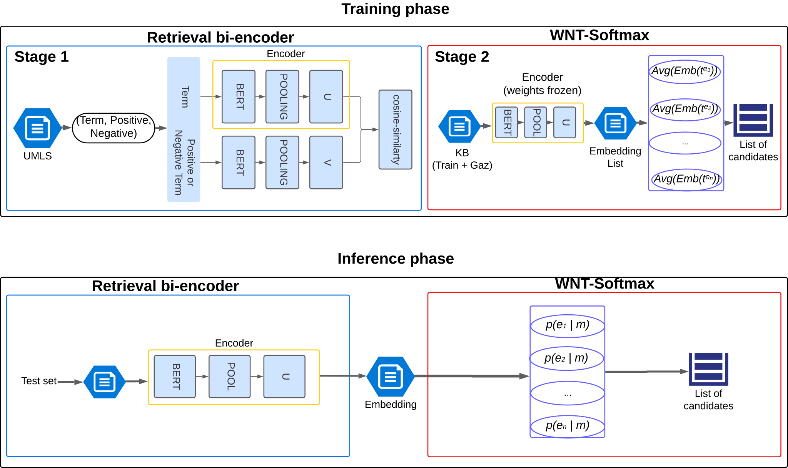

# Multilingual Weighted Normalized Temperature Softmax (WNT-Softmax)

Welcome to the official repository of the Multilingual Weighted Normalized Temperature Softmax (WNT-Softmax), developed by the Computational Intelligence and Biomedicine (ICB) group at the University of Málaga. This project leverages advanced machine learning techniques to enhance language processing tasks across multiple languages.




## Environment main settings

- Python 3.10+
- PyTorch 2.0.1

## Installation

Clone the repository and install the required packages:

```bash
git clone https://github.com/FernandoGD97/WNT-Softmax.git
cd WNT-Softmax
```

### Requirements

```bash
pip install -r requirements
```

## Usage

The repository includes scripts for data generation and model training. Here are examples of how to use these scripts:

### Data Generation

Generate data for Swedish using a machine translation model (If you don't have direct translation from spanish):

```bash
python data_generator.py --lang "sv" --model "Helsinki-NLP/opus-mt-en-sv" --data_path "../data/SympT-EMIST/en/train_df.tsv" --from_spanish false --log_file "../logs/data_generation_sv.log"
```

Generate data for French:

```bash
python data_generator.py --lang "fr" --model "Helsinki-NLP/opus-mt-es-fr" --log_file "../logs/data_generation_fr.log"
```

### Training the WNT-Softmax Model
Train the model with English data for 10 epochs:

```bash
python WNT_Softmax_training.py --lang en --epochs 10 --log_file "../logs/wnt-multisapbert.log" --save_model True
```

## Features

- **Multilingual Support:** Capable of processing and understanding multiple languages.
- **Advanced Machine Learning Techniques:** Utilizes state-of-the-art models and frameworks.
- **High-Performance Computing:** Initially deployed and tested on an NVIDIA RTX 2080 Ti GPU, though not a mandatory requirement.

## Contributing

We welcome contributions from the community. Please submit your pull requests to the `main` branch and ensure your code adheres to the existing style.


